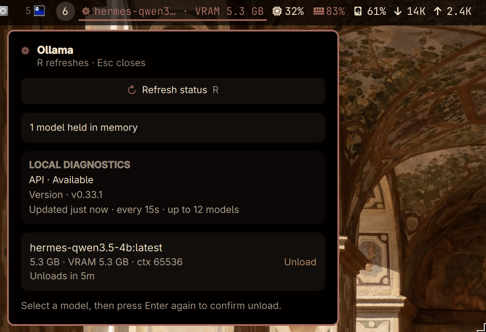

# Ollama Status

A standalone Omarchy bar widget showing the local Ollama API state and models held in memory. It uses Ollama's documented `GET /api/ps` endpoint rather than parsing command-line output.

## Compatibility

Built for Omarchy's Quattro/Quickshell bar plugin host, using its shared third-party service and standard panel lifecycle APIs. The optional copy-model-name action uses `wl-copy` from `wl-clipboard`.

## Preview



## Setup

1. Install [Ollama](https://ollama.com) and start it in the way you prefer (a user service, a terminal, or another supervisor).
2. Ensure `curl` and `python3` are installed. Install `wl-clipboard` as well if you want the copy-model-name action. Responses are validated locally before the widget uses them.
3. Install and enable the plugin:

   ```bash
   omarchy plugin add https://github.com/Brams-s/omarchy-ollama-status.git --enable
   ```

4. Add **Ollama Status** to a bar section if it is not placed automatically.

The default endpoint is `http://127.0.0.1:11434`. `OLLAMA_HOST` may only be a literal loopback endpoint (`127.x.x.x` or `[::1]`, with an optional port); hostnames and remote addresses are rejected. Requests ignore curl configuration and proxies.

## Behaviour and controls

- One shared service refreshes at startup, when any card opens, and every 15 seconds by default; unavailable endpoints use a bounded backoff. A newer manual refresh supersedes an in-flight status request.
- Clearly reports a missing `curl`, an unreachable server, invalid API data, and failed unload requests.
- Does not start or stop a service: that policy belongs to your setup.
- **Unload** sends Ollama's documented non-streaming chat request with `messages: []` and `keep_alive: 0`. Only one unload can run at a time.
- Open the widget to refresh. In the panel, use **R** to refresh, **C** to copy the selected model’s canonical name to the Wayland clipboard, **Esc** to close, arrow keys to select a loaded model, and **Enter** twice (or click twice) to confirm unloading it. Models without an actionable canonical name remain visible but cannot be copied or unloaded. The copy timeout covers starting `wl-copy` and establishing the selection, not ongoing clipboard ownership. The summary reports total loaded models and aggregate VRAM when Ollama provides it. These controls follow the standard Omarchy panel lifecycle and keyboard navigation behavior.

## Configuration

Configure each bar-widget entry with **Refresh interval (seconds)** (5–300, default 15), **Maximum displayed models** (1–12, default 12), and **Compact mode** (default off). Compact mode shortens the horizontal bar label while retaining the model or availability state; vertical bars remain icon-first. The kept-loaded service validates these bounds and uses one stable effective configuration across monitor instances.

## Local checks

Run `./verify.sh` from this directory. It validates the manifest and release metadata, preview asset reference, helper sanitization, loopback-only endpoint policy, fixed executable identities, allowlisted child environments, whole-operation deadlines, bounded pipe/result handling, process cleanup, and unload request behavior without contacting Ollama.

CI performs non-conditional static QML validation in an immutable Arch container with Qt, Quickshell, and a pinned Omarchy Quattro shell import tree. It uses the digest-only official `docker.io/library/archlinux@sha256:694da1fce635e3a14d90751941b08f02c500e8724682f7a00768e7152251ec34` reference plus one matching dated Arch Archive epoch for all CI packages, then logs the image date/digest, archive epoch, package URLs, and installed tool versions. The QML policy fails on `import`, `missing-type`, and `unresolved-type` diagnostics; other diagnostics remain visible but nonfatal because Omarchy injects runtime bar and panel objects that static type inference cannot fully describe. To run the same import-aware lint locally, provide a matching shell tree and run `OMARCHY_SHELL_ROOT=/path/to/omarchy/shell ./ci/qml-validate.sh`. This validates imports and static types only; manually verify clipboard, panel behavior, and all compositor/runtime interactions in a local Omarchy/Quattro session. CI does not start Hyprland or a graphical Quickshell runtime.

## Removal

Remove the plugin with the canonical Omarchy command:

```bash
omarchy plugin remove brams.ollama-status
```
