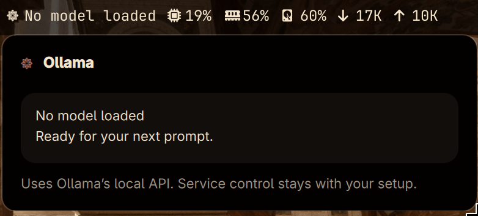

# Ollama Status

A standalone Omarchy bar widget showing the local Ollama API state and models held in memory. It uses Ollama's documented `GET /api/ps` endpoint rather than parsing command-line output.

## Preview



## Setup

1. Install [Ollama](https://ollama.com) and start it in the way you prefer (a user service, a terminal, or another supervisor).
2. Ensure `curl` and `python3` are installed. Responses are validated locally before the widget uses them.
3. Install and enable the plugin:

   ```bash
   omarchy plugin add https://github.com/Brams-s/omarchy-ollama-status.git --enable
   ```

4. Add **Ollama Status** to a bar section if it is not placed automatically.

The default endpoint is `http://127.0.0.1:11434`. `OLLAMA_HOST` may only be a literal loopback endpoint (`127.x.x.x` or `[::1]`, with an optional port); hostnames and remote addresses are rejected. Requests ignore curl configuration and proxies.

## Behaviour

- One shared service refreshes at startup, when any card opens, and every 15 seconds; unavailable endpoints use a bounded backoff.
- Clearly reports a missing `curl`, an unreachable server, invalid API data, and failed unload requests.
- Does not start or stop a service: that policy belongs to your setup.
- **Unload** sends Ollama's documented non-streaming chat request with `messages: []` and `keep_alive: 0`. Only one unload can run at a time.

## Local checks

Run `./verify.sh` from this directory. It validates the manifest, helper sanitization, shell syntax, loopback-only endpoint policy, curl isolation, bounded response handling, and unload request behavior without contacting Ollama.

## Removal

Disable the plugin with `omarchy plugin disable brams.ollama-status`, then remove it from your Omarchy plugins directory.
